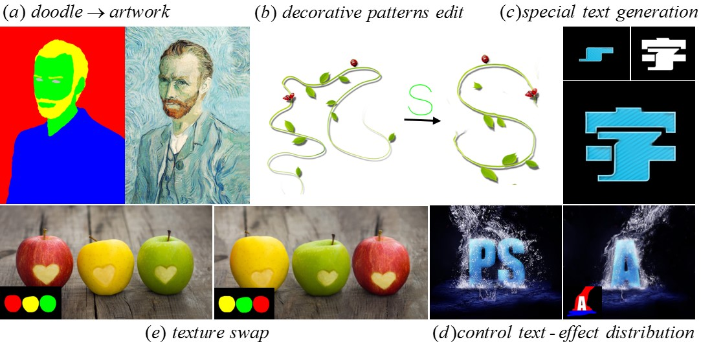

# CFITT
The Implementation for "A Common Framework for Interactive Texture Transfer"



### A Common Framework for Interactive Texture Transfer <br>(CVPR 2018, spotlight).

Project page: https://menyifang.github.io/projects/CFITT/CFITT.html

Check our our [paper](<https://menyifang.github.io/projects/CFITT/CFITT_files/Men_A_Common_Framework_CVPR_2018_paper.pdf> )  and  [supplementary](<https://menyifang.github.io/projects/CFITT/CFITT_files/supp_CFITT.pdf>) here.


## Conventional Online Texture Transfer (COTT)
This also a Matlab imlementation of the paper "A Common Framework for Interactive Texture Transfer", CVPR 2018.

### Startup external codes: 
Run the function startup.m.

### Texture transfer:
Run the function demo.m
use the main function texture_transfer in demo.m with the parameter configuration.

#### Example: 
[targetStylizedFinal,optS] = texture_transfer(sty, src, trg, imgpath, optS);   

### External codes:

   1. Flann: for fast approximate nearest neighbor searching.
   
      http://www.cs.ubc.ca/research/flann/

   2. mirt2D_mexinterp: for fast 2D linear interpolation.
   
      http://www.mathworks.com/matlabcentral/fileexchange/24183-2d-interpolation/content/mirt2D_mexinterp/mirt2D_mexinterp.m

   3. cpd: for coherent point drift.
   
      http://www.bme.ogi.edu/~myron/matlab/cpd/

   4. Saliency: for content-aware saliency detection.
   
      https://cgm.technion.ac.il/Computer-Graphics-Multimedia/Software/Saliency/Saliency.html

   5. tpsWarp: for thin-plane spline warping.
   
      https://ww2.mathworks.cn/matlabcentral/fileexchange/24315-warping-using-thin-plate-splines


### Citation

If you found the software useful for your work, please cite our paper:

```
@inproceedings{men2018common,
  title={A Common Framework for Interactive Texture Transfer},
  author={Men, Yifang and Lian, Zhouhui and Tang, Yingmin and Xiao, Jianguo},
  booktitle={Proceedings of the IEEE Conference on Computer Vision and Pattern Recognition},
  pages={6353--6362},
  year={2018}
}
```


### Acknowledgments
Our code is inspired by [Text-Effects-Transfer](https://github.com/williamyang1991/Text-Effects-Transfer/).

